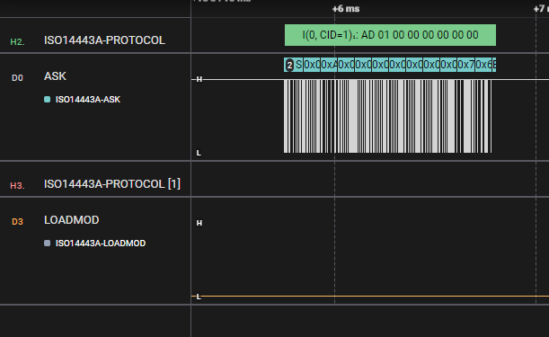
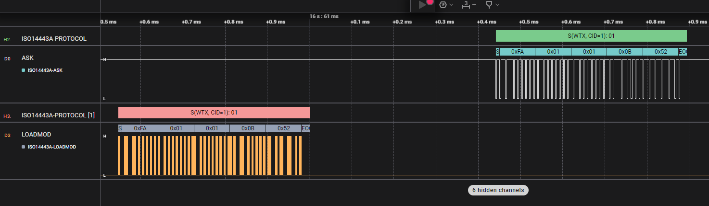

# ISO14443A protocol analyzer

This is an high level analyzer for the ISO14443A-3 / -4. It should be used in conjunction with [this ISO14443 low level analyzer](https://github.com/timrid/Iso14443aAnalyzer).

Currently not all block types are supported. Especially the ISO14443A-3 anticollision is only partly supported.

Example of an Frame with an I-Block:

Example of WTX Frames:

